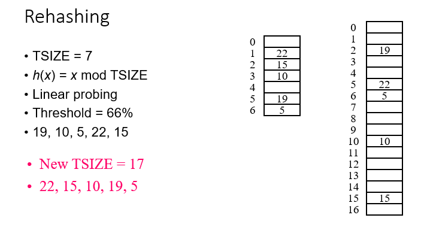

# Hash tables
## & unordered map and sets 

# Motivation of Hash Tables
- hash table unordered set and map slightly faster , more space 
- array of linked list 
- more space , faster speed
- Search Trees
- Find, Insert, Delete
- FindMin, FindMax, PrintSortedList
- Ordering information
- O(log n) average, or worst-case running time
- Hash Tables
- Find, Insert, Delete
- Does not support operations that require the knowledge of the ordering among the data.

- FindMin, FindMax, PrintSortedList
- O(1) average running time

# Hashing

The location where the record is stored is computed by h(x) 

> Example:
Suppose that there are at most 100 students in the department.
	How to store student information so that we can access them quickly?
Social security 9 digit:
X mod 10000000 => last 2 digit
  SS# 347661245 => A[45]
  SS# 123446637 => A[37]

## Problem: Collisions
If x != y => f(x) != f(y) : perfect hashing
Practically, perfect hashing very difficult to find

## Collision 
- two numbers have the same hash function 
- increase in size can reduce chance of collision 

## collision handling 


## simple idea 


# Hash table
A pair <key, value> is stored in a slot of hash table
The array index where <key,value> is stored is determined by hash function h(key)


# Examples of hash functions

h(x) = x mod N
h(x) = (ax+b) mod N, gcd(a,N)=1


For strings: convert a string into a number.
	example: for a string of 3 chars  k1k2k3: h(K) = k1*272 + k2*271+k3*270

## Hash Table (continued)

- Table size
- Entries are numbered 0 to TSIZE-1
- Mapping
- Simple to compute
- Ideally 1-1: not possible
- Even distribution
- Main problem
- Choosing table size
- Choosing good hash function
- What to do on collisions


## Table Size

### Composite
- 10: 2*5
- 300: 2*2*3*5*5
- More chance of collision

###  Prime
- 11
- 10007
- Less chance of collision

## Collisions
- More than one item is mapped to the same slot
- How to handle collision?
Open addressing (closed hashing): 
	Find an open slot
	value is also stored in the table 
- linear probing: find next available slot 
In general, hi(x)
hi(x) = h(x) + k*i (mod N), for some k
hi(x) = h(x) + i2  (quadratic) \

- Chaining (Open hashing)
	Colliding items are placed in a linked list.

## Closed Hashing (Open Addressing)

- No secondary data structure
- All the data goes inside the table.
- On collision, try alternate cells until an empty cell is found.
- Bigger table is needed.
- Load factor should be below 0.5.


## Collision Resolution

### Try alternate cells
- Cells h0(x),  h1(x),  h2(x),  … are tried in succession
- hi(x) = ( hash(x) + f(i) ) mod TSIZE
- f(0) = 0
f is the collision resolution strategy.
### Linear probing
f(i) = i


## Linear Probing


- If the table is not full, a free cell can always be found. 
- Blocks of occupied cells
- “primary clustering”
- Inserting a key that hashes into the cluster
- Takes several attempts
- Add to the cluster
- Deleting a key
- Use lazy deletion


# Deletion


# Quadratic Probing


### Eliminate primary clustering

- If the table is not full, no guarantee of finding an empty cell.
### Elements that has the same hash value will probe the same set of alternate cells
- Secondary clustering
- Not a big problem in practice


## proof


## Performance: Open Addressing


## Open hashing (separate chaining)


## Time Complexity

### Insertion : 
- average O(1)
- worst case: O(n)
### Deletion
- For open addressing, requires deletion flag
may cause trouble for open addressing
restructuring the table may be necessary after many deletions
For chaining, relatively easy 


### Problems with Table Size

### Table too full
Running time too long
Inserts could fail (closed hashing)
### Must be chosen in advance
Don’t know the number of elements
### Rehashing
Build a new table that is about twice as big
Hash the elements into the new table




## Hashing Summary

### Table size: Prime
### Hash function: very difficult to choose
### Collision handling
- Open hashing (separate chaining)
- Closed hashing (open addressing)
- Linear probing, Quadratic probing
### lambda : number of elements divided by the table size.
- open hashing: lambda  ~= 1
- closed hashing: lambda   ~= 0.5 ~ 0.7
### Rehashing
- do the insert again to the new table from the original table 


# unordered_set and unordered_map in STL
- These C++ STL libraries are implemented with hash tables
- Almost the same usage as set and map


# Hash Table example 

````c++
#include <iostream>
#include <unordered_map>
using namespace std;


// best case: 0(1)
// worst case: 0(n)
int main(){


std::unordered_map<int, std::string> myHashTable;
std::unordered_map<std::string, std::string> stringHashTable;

myHashTable.reserve(10);   // sets capacity 


// example svalues with keys for hash table
myHashTable[100] = "Spongebob";    
myHashTable[123] = "Patrick";  
myHashTable[321] = "Sandy";  
myHashTable[555] = "Squidward";  
myHashTable[777] = "Gary";  


// myHashTable.erase(777);

 for (const auto& key : myHashTable) {
        std::cout << "Key: " << key.first 
        << " Value: " << key.second <<
        ", Hashcode: " << myHashTable.hash_function()(key.first) % 10 << std::endl;
    }


// example values with keys for hash table
stringHashTable["100"] = "Spongebob";    
stringHashTable["123"] = "Patrick";  
stringHashTable["321"] = "Sandy";  
stringHashTable["555"] = "Squidward";  
// stringHashTable["555"] = "Squidward", "Gary";   do this to avoid collision or unordered map will automatically set them to the same key 
stringHashTable["777"] = "Gary";  

 for (const auto& key : stringHashTable) {
        std::cout << "Key: " << key.first 
        << " Value: " << key.second <<
        ", Hashcode: " << stringHashTable.hash_function()(key.first) % 10  << std::endl;
    }// there is a collision , if increase the size i can avoid this , but if not I can make a bucket and turn it into a linked list, also automatically set with unordered maps. 


return 0;

`````