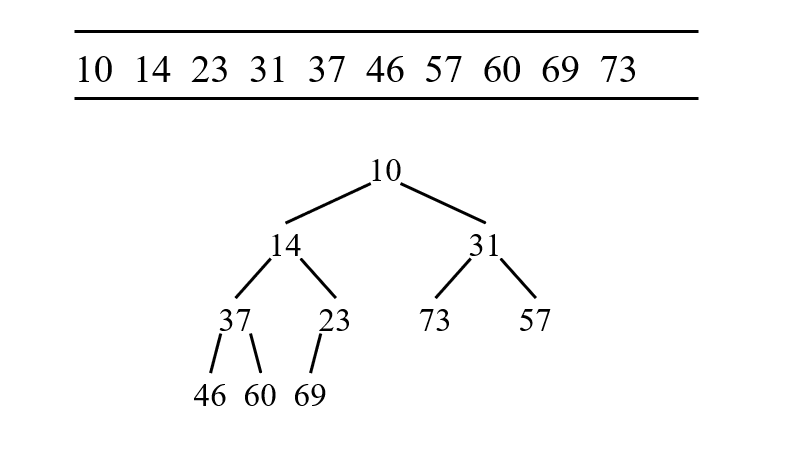
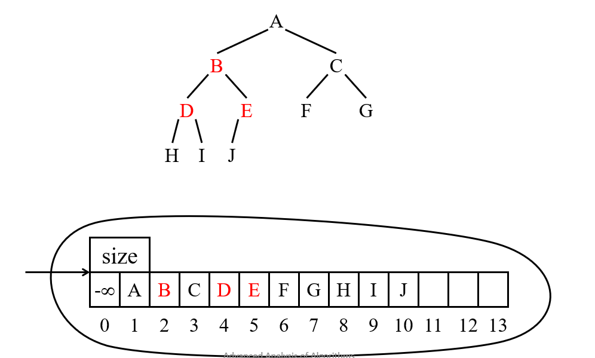
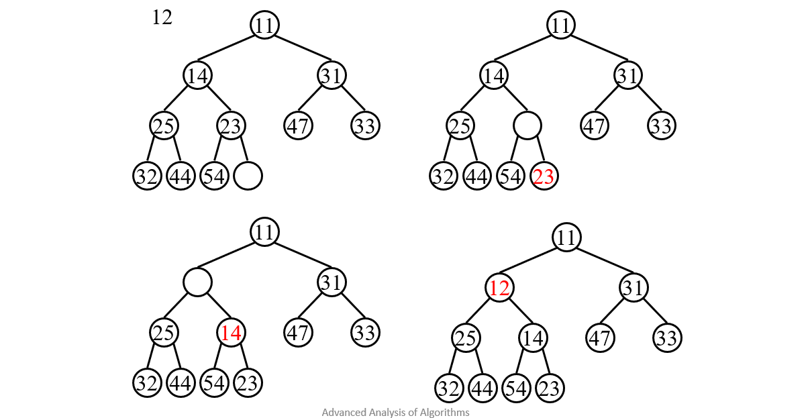
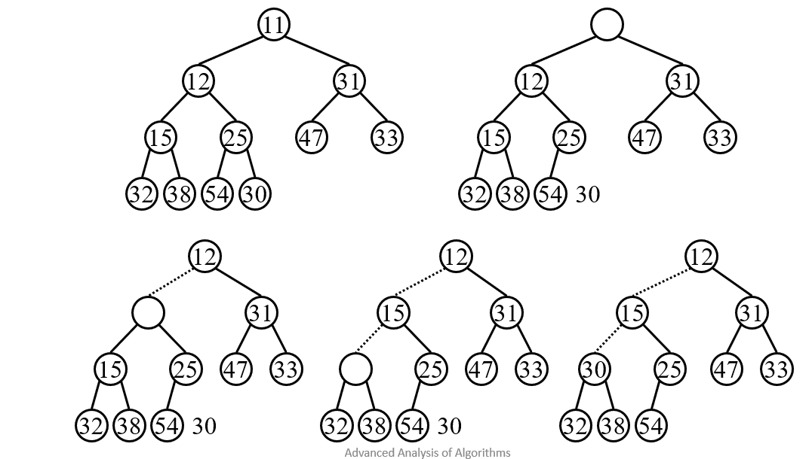

# Map and Set 

### very common and useful data structures 


````c++
#include <set>
#include <iostream>
#include <map>
using namespace std;

int main(){
    set<int> S;

tree_node* root=NULL;
cons int n = 100000;
int i;
// strand(time(NULL)) // using time to make true random numbers 
// rand () generates random numbers with integers 1-10.
t1 = time(NULL);
for (i=0; i<n ;i++){
    int k = rand();

    // cout << k << endl;  

    // root = insert(root,k);

    S.insert(k);
}
time_t t2 = time(NULL);
cout << "time spent " << t2-t1 << '\n';
// in_traversal(root); cout << endl;
cout << "hieght of tree " << height(root) << '\n';


// iterator using set function
// for each loop with auto funnction to detect variable type automatically. 
for (auto x:S)  {   
    cout << x << ", ";
}
cout <<'\n';


// iterator , iterates whole data structure.
//     set<int>::iterator it;
//     for(it=S.begin();it!=S.end()){
//         cout << *it << ", ";
//     }
// cout << endl;>>


}


````

# MAP

````c++
#include <set>
#include <iostream>
#include <map>
using namespace std;


int main(){
    map<string, double> GPA;
    // nodes in tree based on name 
    GPA("alice") = 3.5;      // insert 
    GPA("bob") = 2.8;     // insert 
    GPA("alice") = 3.7;      // updates alices

   // currently two nodes 

}
````
# Binary Heap and Priority Queue 

## Priority Queue

### Definition

### Queue
- first-in, first-out
### Priority queue

### Highest Priority First
### Operations
- Insert
- DeleteMin


## Applications


### Print queue
- Each job has a priority.
- The highest priority job is printed next.

### Event Simulation

- Each event has a time at which it occurs
- Each new event is put into a priority queue.
- The simulator gets the next event from the priority queue and processes it.

# Binary Heaps Implementation of Priority Queue

 

### Structure property
- Complete binary tree: a binary tree that is completely filled except for the bottom level which is fillled from left to right.
- 2^h <= n <= 2^h+1 -1.
- h = log n = O(log n)
### Heap order property
- For any pair of nodes X, if X has a child Y, then X<Y
- The smallest key is at the root
- FindMin takes O(1) time (not DeleteMin) 
### Maintain the properties when manipulate heaps


# Basic Heap operations
- Insert
- Deletemin
- Construct Heap

# Array Implementation




### Store the heap in an array
- Top-down, left-right
### The array has a position 0 containing - infiniti
### The first element is stored at position 1
### Element at position i
- Left child: 2i
- Right child: 2i+1
- Parent: i/2

# Insert
````c++ 
insert (X) {
N = N+1;
A[N] = X;
i = N;
while ((i >1) && (A[i/2] >X)) { 
 	A[i]  = A[i/2];
	i = i/2;
   }
A[i] = X;
}

````
> Kind of percolate up




# Deletemin

````c++ 
deletemin (A) {
ans = A[1];
A[1] = A[N];
N= N-1;
percolatedown (A,1);
return (ans);
}

percolatedown(A,i) {
if (2i >N) return;  // the node “i” is a leaf node;
if ((2i + 1 <= N) && (A[2i+1] < A[2i] ))  j = 2i+1 ;
else j = 2i;
if (A[j] < A[i] ) { 
        swap (A[i], A[j]); 
        percolatedown (A, j);
}
}


````




# Build Heap
### Approach 1: insert (A[i]), i=0,1,...n.
- complexity O(nlogn)
### Approach 2:
- Place N keys into the tree in any order
- Use percolate down to create heap-ordered tree
- Code
- Buildheap () {
for i=N/2  down to 1  { percolatedown (i); }
### Approach 3:
- Suppose that a tree with root T, and left subtree T1 and right subtree T2 is a heap. How to adjust them and make a heap?
- Use percolate down.


# Complexity of build heap


- T(n) = 2T(n/2) + logn
- n=2k
- T(2k) = 2T(2k-1) + k
- tk = 2tk-1 + k
- tk = O(2k)    
- T(n) = O(n)

# Priority Queue in C++ STL

- #include <queue>
- priority_queue<int> Q
- Operations:
- top()
- push()
- pop()
- size()
- empty()
